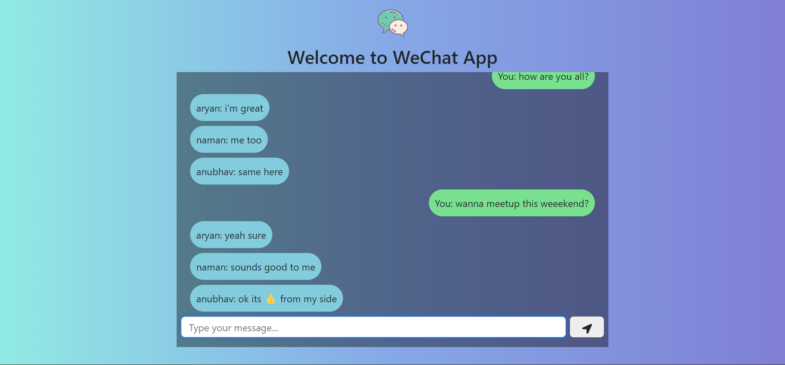

# WeChat
A realtime chat application design with nodeJS and socket.io

## Screenshots


<br />
<br />
<br />
<br />


## Installation

Cloning the repository:

```bash
git clone https://github.com/satyam16000/WeChat.git
cd WeChat
```
Installing dependencies:

```bash
npm install
```
Start the application:

```bash
node index.js
```
Now you can open the app at http://localhost:3000/ in your browser 
